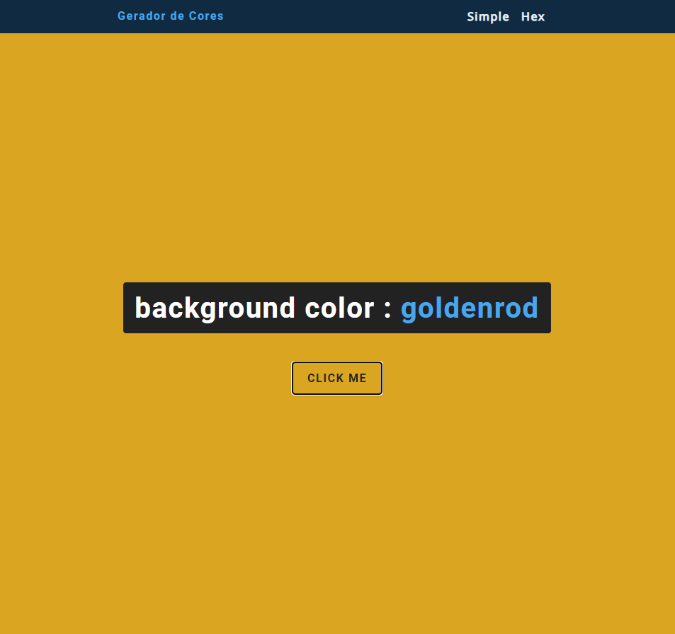

<h1>Gerador de Cores</h1>

 Este é um simples gerador de cores que gera cores hexadecimais aleatórias e as exibe em uma página web. 

Aqui vai o gerador de cores.

## Como Usar

<ol>
  <li><a href="https://leonardvsc.github.io/geradordecores/">Acessar Página</a></li>
  <li>Basta clicar no botão "click me" para gerar uma nova cor de fundo aleatória</li>
</ol>

  

## Contribua

Sinta-se à vontade para contribuir com sugestões, correções de bugs ou melhorias no código.

## Versão

Versão 1.0.0

## Changelog

1.0.0 (Data): Versão inicial do gerador de cores. 

## Licença

Este projeto está sob a licença MIT.

## Agradecimentos

Um agradecimento especial a <a href="https://github.com/john-smilga">Jogn Smilga</a> por inspiração e referências.

